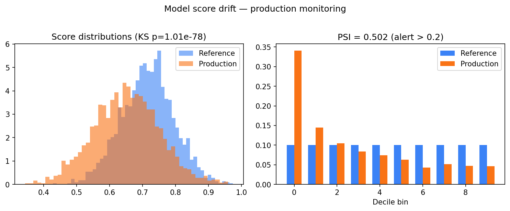

# mitx-186501x-inference-lab

**MITx 18.6501x — Fundamentals of Statistics**

Laboratório de estatística inferencial: intervalos de confiança, delta method, testes de hipótese e **monitoramento de drift** em scores de modelos de produção.

---

## Objetivos de estudo

O 18.6501x formaliza a inferência que sustenta decisões com dados finitos: estimação pontual não basta — é preciso **intervalos de confiança**, **testes de hipótese** com controle de erros tipo I/II, e **métodos de propagação de incerteza** (delta method). Este repositório adiciona uma camada de produção: detectar quando a distribuição de scores de um modelo em produção **diverge** da referência de treino (KS test + PSI). O estudante deve conectar MLE teórico a **monitoramento operacional de ML**.

---

## Resultados — model drift

| Métrica | Valor | Threshold |
|---------|-------|-----------|
| KS statistic | **0.178** | — |
| KS p-value | **< 0.001** | α = 0.05 → drift detectado |
| PSI | **0.191** | alerta se > 0.2 |
| Δ mean score | 0.702 → 0.659 | −6.2% shift |

---

## Figuras e interpretação



**Painel esquerdo:** histogramas da distribuição de scores em referência (azul) vs produção (laranja). A separação visual confirma drift — o modelo está ranqueando inputs de forma diferente do esperado. O p-value KS < 0.001 formaliza essa observação.

**Painel direito:** PSI por decil mostra *onde* a distribuição mudou. Decis com barras laranja maiores que azuis indicam **acúmulo de massa** em faixas de score diferentes. PSI=0.191 está no limiar de alerta (0.2) — em produção, acionaria revisão do modelo ou retreinamento.

Causas típicas: mudança de perfil de usuário, data leakage corrigido, degradação de feature pipeline, ou ataque adversarial.

---

## Módulos

| Módulo | Técnica | Comando |
|--------|---------|---------|
| `notebooks/` | 10 notebooks (MLE, CIs, tests) | Jupyter |
| `homeworks/` | Delta method, Bernoulli | `python homeworks/hw2_delta_method.py` |
| `model-drift/` | KS + PSI | `python model-drift/run.py` |

## Setup

```bash
pip install -r requirements.txt
python docs/generate_figures.py
```

---

## Aprendizados e aplicação no mercado

Estatística inferencial é o antídoto contra **overfitting narrativo**: "o modelo melhorou" precisa de intervalo de confiança; "não há diferença" precisa de poder estatístico. Em produção, drift detection (KS/PSI) é pré-requisito de **MLOps maduro** — complementa métricas de accuracy com monitoramento de distribuição de inputs e outputs. Para CTO, este repo justifica investimento em observabilidade de modelos: detectar degradação antes que o usuário perceba, e quantificar incerteza antes de decisões automatizadas (LGPD Art. 20).

---

## Autor

**Guarantã Almeida** — [github.com/guaranta](https://github.com/guaranta)
